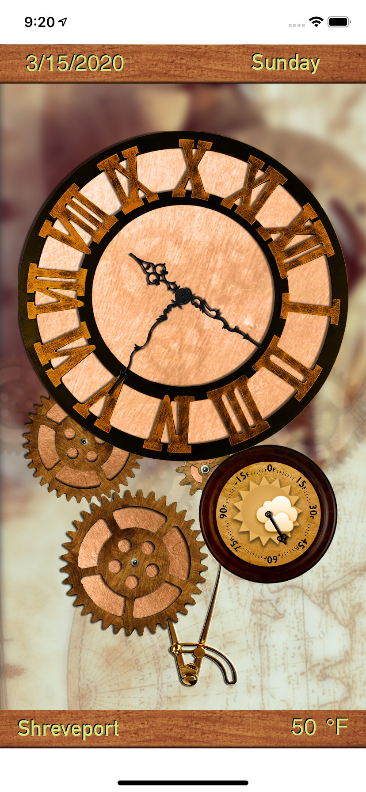
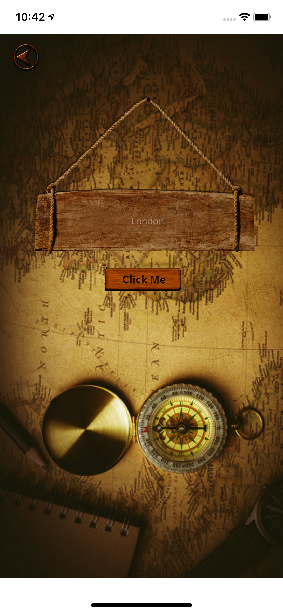
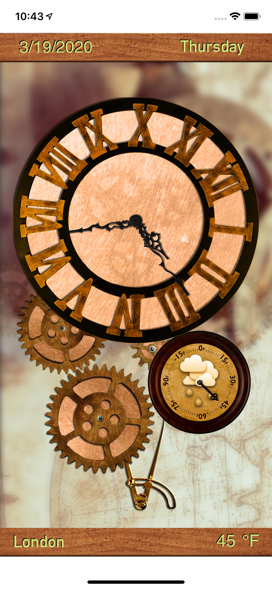

@author bm1905 

## iOS Clock Application

This is iOS mobile application that displays analog clock along with real-time updated weather using weathermap API. The location can be changed in the application.

## Fixes to be made yet

The graphics contents were genertaed only for iPhone xR. So, the layout constraints are not set yet universal. Once, all the required graphics are generated, constraints will be set properly and the application will be deployed to Apple Store.

## Screenshots

